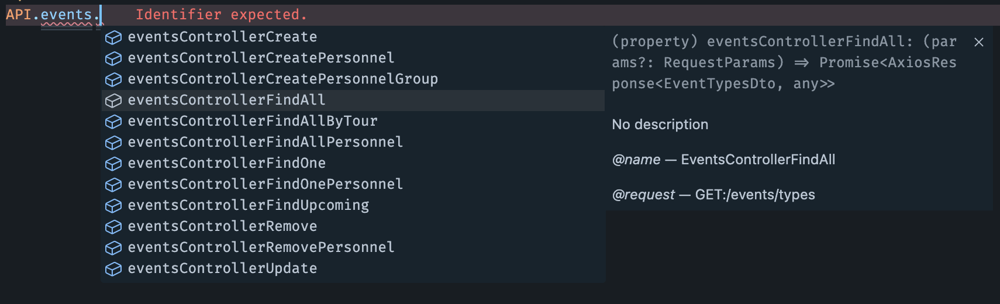

# Api client

The common issue in Client <-> Server applications is the issue of typing the data during communcation. We can solve this by generating a OpenAPI schema on our backend and create an API Client on the frontend.

## OpenAPI schema generation

For this purpose on the backend we can use [@nestjs/Swagger](https://docs.nestjs.com/recipes/swagger)

## Frontend consumption

To generate a client on the frontend we have add a dev dependency called
[swagger-typescript-api](https://www.npmjs.com/package/swagger-typescript-api).

```bash
pnpm add -D swagger-typescript-api
```

after that we can create a script that will generate us a new client from a schema file. To do this add this script to you `package.json`

You can configure the path to your BE api-schema.json and file/class names of the generated client.

```json
{
   "scripts": {
    ...,
    "generate:client": "swagger-typescript-api -p ../api/src/swagger/api-schema.json -o ./src/api --axios --name base-api.ts --api-class-name BaseApi",
  },
}
```

Given command will create a `base.api.ts` file where our BaseApi client will be created. With it you can do anything you want that is availble in the axios client

eg. use interceptors

```ts
export const API = new BaseApi({
  baseURL,
  headers: {
    Authorization: getAuthorizationHeader(),
  },
});

API.instance.interceptors.response.use(
  (response) => {
    return response;
  },
  (error: AxiosError) => {
    if (error.response?.status === 401) {
      useAuthStore.getState().setTokens(null, null);
      removeAuthHeader();
      router.navigate("/login");
    }
    return Promise.reject(error);
  }
);
```

Now all the methods on the API are fully typed and you can use them in the following way


