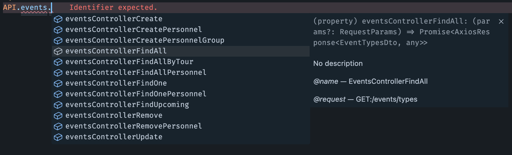

# Api client

The common issue in Client <-> Server applications is the issue of typing the data during communcation. We can solve this by generating a OpenAPI schema on our backend and create an API Client on the frontend.

It is available in Boilerplate via `pnpm generate:client` in `web-app`.

On the Backend it uses [@nestjs/Swagger](https://docs.nestjs.com/recipes/swagger) to generate a OpenAPI file.
On the Frontend we generate it via [swagger-typescript-api](https://www.npmjs.com/package/swagger-typescript-api).

Now all the methods on the API are fully typed and you can use them in the following way

