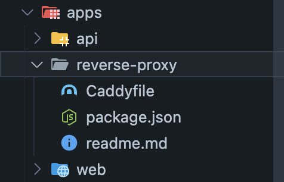

# Proxy and certs

Have you ever found yourself in the ports hell? Having multiple applications and looking on which port it is? Or have you ever needed https on your localhost to test specific features? Reverse proxy is here to help! Also you'll get pretty address like `yourproject.localhost`.
For the tool we will use [Caddy](https://caddyserver.com/)

## How to setup Caddy

Caddy can be installed via [Homebrew on MacOs](https://caddyserver.com/docs/install#homebrew-mac),
Or on other [platforms](https://caddyserver.com/docs/install)



Once we got it installed we can create a new folder inside `apps` called `reverse-proxy`(look img above). Inside of it we can create a `package.json` with the following content:

```json
{
  "name": "project-reverse-proxy",
  "scripts": {
    "dev": "caddy run"
  }
}
```

Now we are able to create the file called `Caddyfile`. The content should be the following adjust to the project needs and ports.

```
api.project.localhost {
	reverse_proxy localhost:3137
}

app.project.localhost {
	reverse_proxy localhost:5137
}

mailbox.project.localhost {
	reverse_proxy localhost:8025
}

storage.project.localhost {
	reverse_proxy localhost:8069
}
```

Last step is to run the `caddy run` in the console manually so it can create the certificates. After that you'll be able to run it with `pnpm dev`
